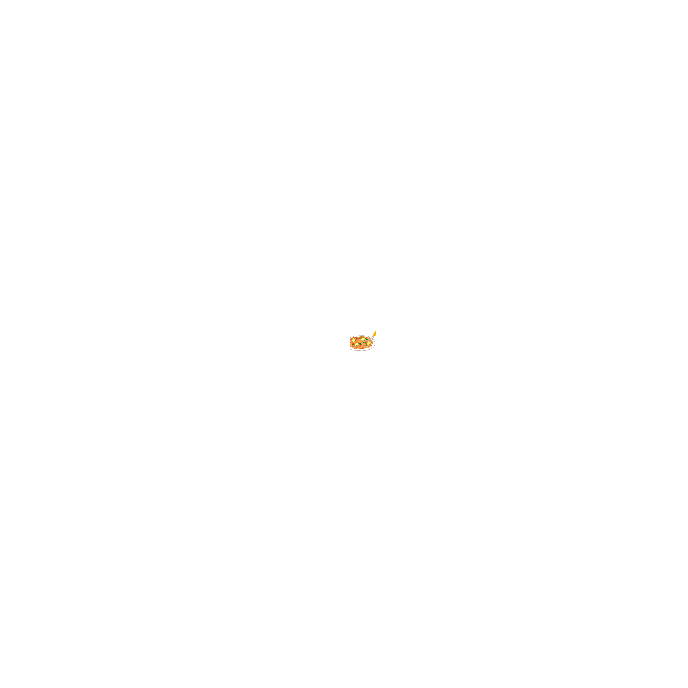

## レストラン「TUBG」
### メニュー
<table class="table-striped">
  <tr><th>メニュー</th><th>料金</th></tr>
  <tr><td>TUBGハンバーガー </td><td>¥600</td></tr>
  <tr><td>TUBG牛ステーキ </td><td>¥1,200</td></tr>
  <tr><td>TUBGハンバーグ </td><td>¥1,100</td></tr>
  <tr><td>TUBGロコモコ丼 </td><td>¥1,000</td></tr>
  <tr><td>TUBGピッツァ </td><td>¥1,000</td></tr>
  <tr><td>TUBGドリンク各種 </td><td>¥400</td></tr>
</table>

<h2>つくしカフェ

</h2>
### メニュー
<table class="table-striped">
  <tr><td>つくしオニオンリング 

</td><td>¥300</td></tr>
  <tr><td>つくしお子様ランチ 

</td><td>¥1,000</td></tr>
  <tr><td>つくしタンドリーチキン 

</td><td>¥500</td></tr>
  <tr><td>つくしパスタ 

</td><td>¥800</td></tr>
  <tr><td>つくし焼きそば 

</td><td>¥700</td></tr>
  <tr><td>つくしシェイク 

</td><td>¥200</td></tr>
</table>
